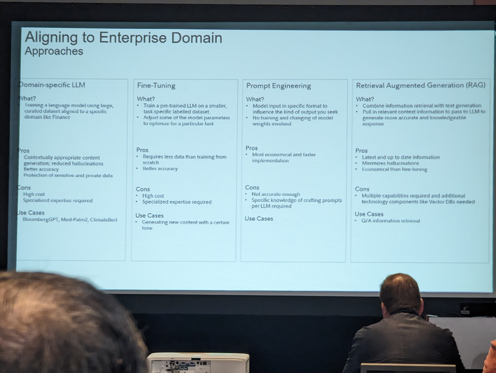
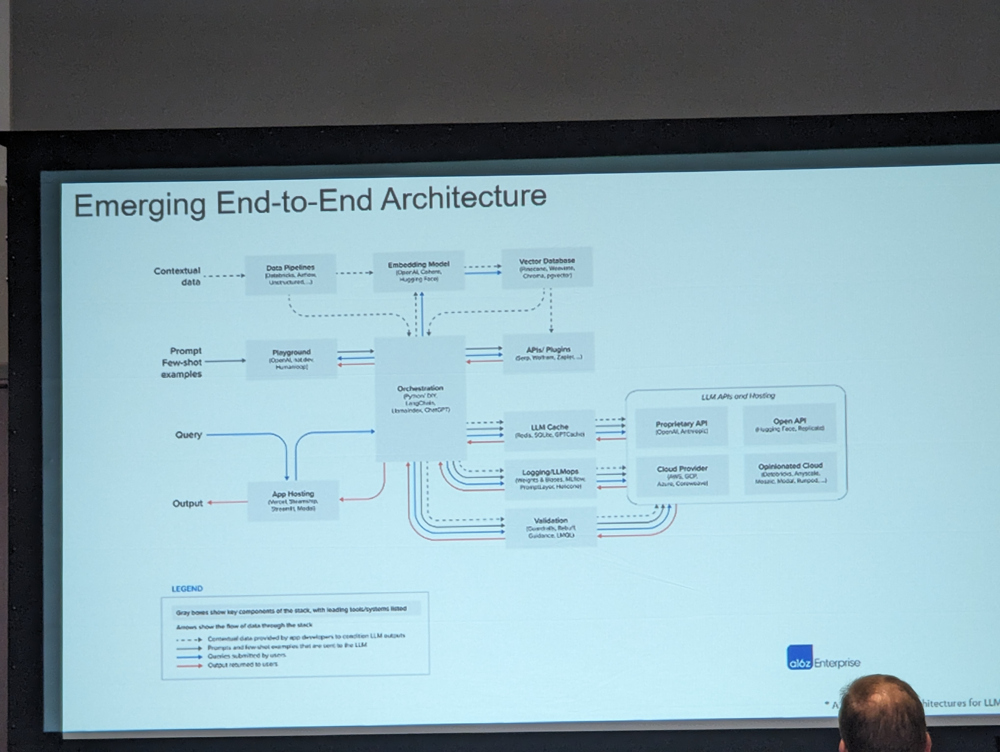
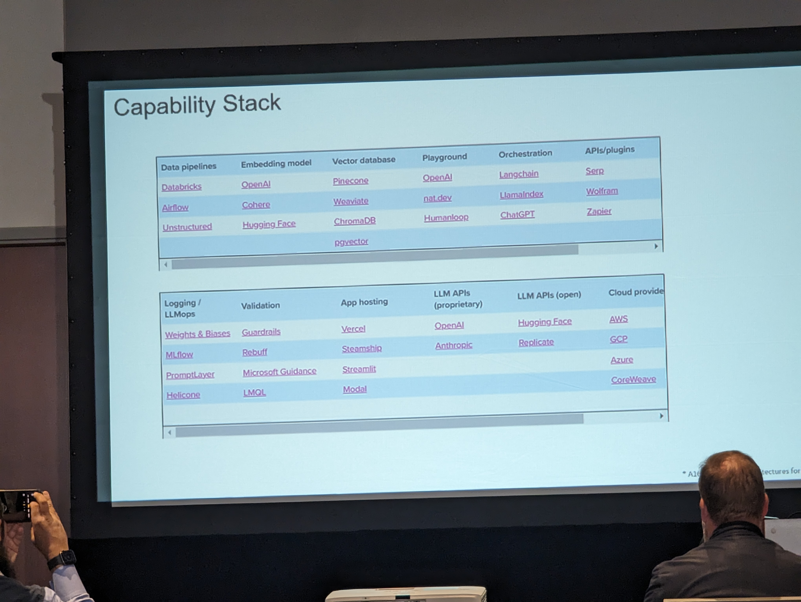

# Generative AI and Enterprise Applications

Foundation Large Language Models
Enterprise data  
Frameworks  

## Use cases  

* Generation
  * marketing content  
  * code  
* Extraction
* Retrieval
* Translating
* Summarization
  * send agent to meeting, get summary

## Considerations  

* Safety
* Ethics
* Compliance

## Project life cycle

* Scope
  * identity and define use case
* Select Model
  * create existing LLM or pre-train one
* Adapt and Align Model
  * Prompt Engineering
  * Fine tuning
  * Human feedback
* Application Integration
  * Evaluation and testing
  * Deploy for inference
  * Augment model and develop llm-based Application

## Practical Considerations

* accuracy - usefulness, consistency, hallucinations
* cost - size, cloud services
* task specific or general purpose - size, outdated training data
* data risks - fair use of data, quality of data used
* Input length(context window) - can't give huge document to model. token = 3/4 word. divide data.  100000 tokens vs. 32k tokens in chatGpt
* latency - runtime performance

### LLMs Size - Evolution

* 100s of parameters to trillions of parameters

## Aligning to enterprise domain

* Approaches
  * Domain specific LLM
    * pros: appropriate content gen; better accuracy
    * cons: high cost, specialized expertise
  * Fine tuning
    * train on smaller data sets
  * Prompt Engineering
    * cons: not as accurate
  * Retrieval Augmented Generation (RAG)
    * output based on latest data
* Tradeoffs:
  * to make it relevant to your domain
  * DST: pE, RAG, FT, DSLLM
  * Cost: DSLLM highest, fT, Tag, prompt eng.
  * Transparency
    * RAD highest, everything else the same
  * hallucination avoidance
    * RAD best. DS, FT, PE
  * latency
    * RAD best; PE, (FT, DST)

### Frameworks

* Llama index, langchain

## Evaluation and testing

* Task based Evaluation
* Human feedback
  * accurate
  * useful
* quality
  * hallucination
  * creativity
  * consistency
* Safety  
  * guardrails
    * bias
    * toxicity
* Explainability

Still needs humans to review and adjust prior to release

## Emerging end to end architecture

* central part is orchestration
    * llama, langchain
* language model and caching in cloud
* prompt Engineering
    * various techniques

## Capability stack

## Takeaways

* LLMs are evolving - use appropriate architecture patterns to shield your Application
  * just task specific models as opposed to gpt4
* test out and iterate - no way out but to try
* human in the loop for now
* careful with data issues
  * fair use
